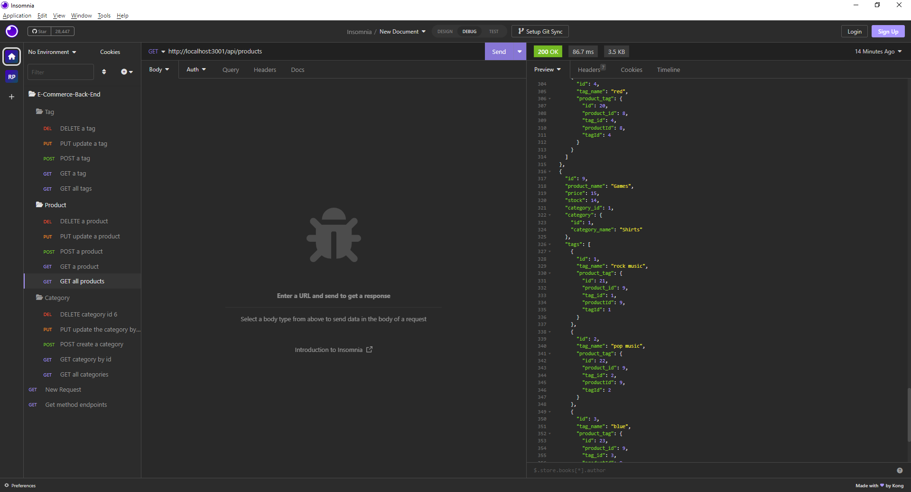

# 13 Object-Relational Mapping (ORM): E-Commerce Back End

## Description
E-Commerce Back End Project is used to build a back end for the e-commerce website that uses the latest technologies to manage a company's employee database.

## Technologies Used

- Javascript
- Node.js
- npm
- SQL
- Sequelize

## Installation

What are the steps required to install your project?
- Provided step by step description on how to get the development of environment running. 
- Installed npm using npm init to initiate the npm.
- After that installed npm using npm i inquirer@8.2.4 to get that version and also get the package-lock.json and node_modules folder.
- Added the mysql password using mysql -u root -p command in command line then execute the schema.sql.Once the database is in use to do npm run seed as the values are in the seeds folder in command line and then to execute npm start command.
- Also imported sequelize connection.

## Usage

Screenshot of E-Commerce Back End Project in insomnia

## Credits

If you followed tutorials, include links to those here as well: https://www.w3schools.com/

## Links

-URL link for the deployed Github application: https://rudrijoshi.github.io/E-Commerce-Back-End-Project/

-URL link for the Github repository: https://github.com/rudrijoshi/E-Commerce-Back-End-Project/

-URL link for the screencastify: https://watch.screencastify.com/v/jxHVXMxv0CwcDTvU0E72